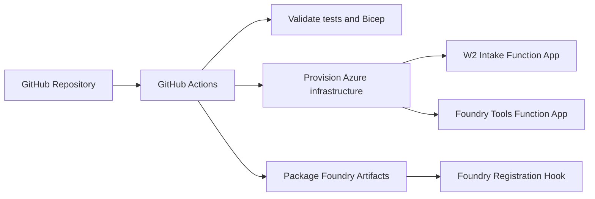

# Deployment Guide

This repository deploys a single solution to multiple Azure hosts. GitHub
Actions is the recommended deployment path.

For the full self-service setup, start with
[Deploy Your Own Environment](docs/deploy-your-own.md).

## Deployment Model



## Azure Hosts

| Host | Bicep template | Source package | Purpose |
| --- | --- | --- | --- |
| W-2 intake Function App | `infrastructure/services/w2-intake/bicep/main.bicep` | `src/services/w2-intake` | Upload and ingestion boundary. |
| Foundry tools Function App | `infrastructure/services/foundry-tools/bicep/main.bicep` | `src/services/foundry-tools` plus `src/foundry_agents` | HTTP tools for the Foundry supervisor. |
| Foundry supervisor agent | `src/foundry_agents/agent.yaml` | Foundry artifacts package | Agent, prompts, tool schema, and eval configuration. |

## Prerequisites

- Azure subscription.
- Azure CLI.
- GitHub CLI.
- PowerShell 7 or newer.
- Permission to create or use the target resource group.
- Permission to assign RBAC roles scoped to the resource group.

## Bootstrap GitHub OIDC

Run this once per GitHub Environment:

```powershell
.\scripts\github\bootstrap-github-actions.ps1 `
  -SubscriptionId "<subscription-id>" `
  -TenantId "<tenant-id>" `
  -ResourceGroupName "rg-agentic-tax-dev" `
  -Environment dev `
  -Location eastus `
  -NamePrefix taxai `
  -GrantUserAccessAdministrator
```

The script creates or updates:

- Resource group.
- Entra app registration and service principal.
- GitHub OIDC federated credential.
- GitHub Environment.
- GitHub environment secrets and variables.
- Resource group role assignments.

The workflow uses OIDC. It does not require a stored Azure client secret.

## Run The Workflow

1. Push to `main`, or open GitHub **Actions**.
2. Select **Deploy Agentic Processing Platform**.
3. Select the environment, location, and name prefix.
4. Keep `deploy_foundry_registration` disabled until Foundry registration is
   finalized for your project.
5. Review the workflow output.

The workflow stages are:

```text
validate
package-w2-intake
package-foundry-tools
package-foundry-artifacts
deploy-infrastructure
deploy-w2-intake
deploy-foundry-tools
configure-foundry-agent, optional hook
smoke-test placeholder
```

## Resource Security

The Bicep templates use:

- Key Vault references for storage and Service Bus connection strings.
- System-assigned managed identities for Function Apps.
- Cosmos DB SQL RBAC for tax fact persistence.
- Storage Blob Data Contributor for generated Form 1040 artifacts.
- Blob containers with public access disabled.
- Application Insights and Log Analytics for telemetry.

## Foundry Registration

Foundry registration is intentionally a hook in the workflow. The artifacts are
packaged, but the final command must be selected for your Foundry project:

- Foundry project endpoint.
- Azure OpenAI deployment name.
- Foundry tool authentication model.
- Tool endpoint base URL.
- Agent naming/versioning strategy.
- Evaluation suite target.

See [Foundry Registration Automation](docs/foundry-registration-automation.md).

## Validate Before Deployment

```powershell
python -m unittest discover -s tests
python -m compileall src tests
az bicep build --file infrastructure/services/w2-intake/bicep/main.bicep
az bicep build --file infrastructure/services/foundry-tools/bicep/main.bicep
```

## Post-Deployment Checks

After the workflow completes:

```powershell
az resource list --resource-group "<resource-group-name>" --output table
az functionapp list --resource-group "<resource-group-name>" --output table
```

Review:

- Function App deployment status.
- Application Insights logs.
- Key Vault secret references resolving successfully.
- Cosmos DB role assignment for the tools Function App identity.
- Blob container for draft Form 1040 artifacts.

Authenticated endpoint smoke tests should be added after API Management or the
final Function authentication model is selected.

## Production Promotion

Use separate GitHub Environments such as `dev`, `test`, `uat`, and `prod`.
Recommended controls:

- Required approvals for `uat` and `prod`.
- Environment-specific resource groups.
- Environment-specific Foundry projects.
- Regulated configuration in production.
- No local extraction mode in production.
- No local human review auto-approval in production.
- Cosmos DB persistence in production.
- Blob artifact storage in production.

## Troubleshooting

| Symptom | Check |
| --- | --- |
| Azure login fails in Actions | Confirm OIDC federated credential subject matches the GitHub Environment. |
| RBAC deployment fails | Run bootstrap with `-GrantUserAccessAdministrator` or assign role-management permission manually. |
| Function deployment fails | Check package artifact, Function App name output, and Application Insights logs. |
| Key Vault reference unresolved | Confirm Function App managed identity has Key Vault `get` and `list` permission. |
| Cosmos access fails | Confirm Cosmos DB SQL Data Contributor assignment exists for the tools Function App identity. |
| Artifact upload fails | Confirm `FORM_1040_STORAGE_ACCOUNT_URL`, Blob role assignment, and container name. |
