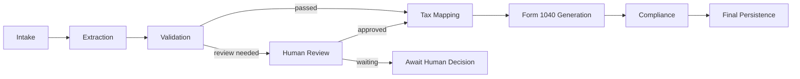
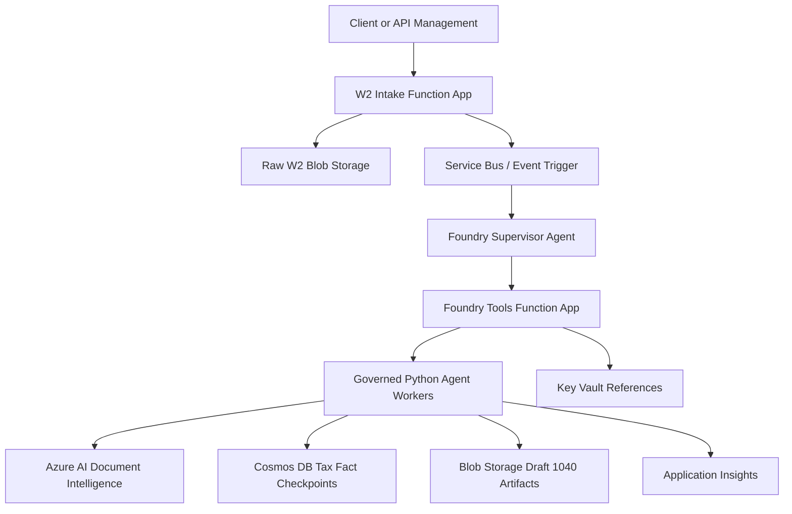

# Microsoft Foundry Tax Intelligence Platform

[](https://www.python.org/downloads/)
[](https://azure.microsoft.com/)
[](https://aka.ms/foundry)
[](https://learn.microsoft.com/azure/azure-resource-manager/bicep/)

Enterprise reference implementation for a Microsoft Foundry-backed tax document
processing platform. The solution demonstrates governed W-2 intake, extraction,
validation, human review, tax mapping, draft Form 1040 generation, compliance,
and durable persistence.

This repository is designed as a professional starting point for teams
evaluating agentic orchestration on Azure. It keeps local development,
production-equivalent adapters, infrastructure, CI/CD, and Foundry binding
artifacts in one versioned solution.

## What This Builds

- W-2 intake Azure Function for secure document ingestion.
- Foundry tools Azure Function exposing governed HTTP tools.
- Supervisor-with-tools orchestration pattern for regulated processing.
- Local agent pipeline that mirrors production configuration.
- Azure AI Document Intelligence adapter for W-2 extraction.
- Cosmos DB checkpoint persistence for resume and audit.
- Draft Form 1040 artifact generation from mapped W-2 facts.
- GitHub Actions deployment pipeline for multiple Azure hosts.
- Foundry agent, prompt, tool, and evaluation artifacts.

## Current Agent Flow



Tax mapping creates a structured `form1040` payload. Form generation turns that
payload into a draft document artifact and stores the artifact metadata in the
governed tax fact record.

See [Agent Flow](docs/agent-flow.md) for the detailed tool, persistence, and
deployment flow.

## Architecture At A Glance



The Foundry supervisor reasons about coordination and user-facing status. The
regulated business actions remain deterministic Python tools with tests,
configuration validation, and durable checkpoints.

## Repository Layout

```text
.
|-- .github/workflows/                 # GitHub Actions CI/CD
|-- docs/                              # Architecture, setup, deployment, flow docs
|-- infrastructure/services/           # Bicep templates by Azure host
|   |-- w2-intake/
|   `-- foundry-tools/
|-- scripts/github/                    # GitHub Actions bootstrap automation
|-- src/foundry_agents/                # Agent workers, prompts, tools, evals
|-- src/services/w2-intake/            # W-2 intake Function App
|-- src/services/foundry-tools/        # Foundry tools Function App
`-- tests/                             # Unit and architecture binding tests
```

## Run Locally

```powershell
python -m venv .venv
.\.venv\Scripts\Activate.ps1
python -m pip install --upgrade pip
python -m pip install -r src/foundry_agents/requirements.txt
python -m pip install -r src/services/w2-intake/requirements.txt
python -m pip install -r src/services/foundry-tools/requirements.txt
python -m unittest discover -s tests
```

Optional local pipeline run:

```powershell
python src/foundry_agents/manual_test_harness.py
```

Local defaults come from `.env.example`. A real `.env` file is ignored by Git
and is loaded only for local development.

## Deploy Your Own Environment

The recommended deployment path is GitHub Actions with Azure OIDC federation.
No long-lived Azure secret is required.

1. Fork or clone this repository.
2. Authenticate locally with Azure CLI and GitHub CLI.
3. Run the bootstrap script:

```powershell
.\scripts\github\bootstrap-github-actions.ps1 `
  -SubscriptionId "<subscription-id>" `
  -TenantId "<tenant-id>" `
  -ResourceGroupName "rg-agentic-tax-dev" `
  -Environment dev `
  -Location eastus `
  -NamePrefix taxai `
  -ProvisionFoundry `
  -FoundryAccountName "taxaidevfoundry" `
  -FoundryProjectName "taxai-dev-project" `
  -FoundryModelDeploymentName "gpt-4o-mini-dev" `
  -FoundryOpenApiConnectionName "w2toolsfnkey" `
  -GrantUserAccessAdministrator
```

4. Push to `main` to run validation checks.
5. Run **Deploy Agentic Processing Platform** manually from GitHub Actions when
   you are ready to provision Azure resources.
6. Review the workflow output for the W-2 intake Function App and Foundry tools
   Function App names.

Detailed setup is in [Deploy Your Own Environment](docs/deploy-your-own.md) and
[GitHub Actions Deployment](docs/github-actions-deployment.md).

## Foundry Integration

The repository includes Foundry-ready artifacts and an opt-in registration
stage in GitHub Actions:

- [agent.yaml](src/foundry_agents/agent.yaml)
- [eval.yaml](src/foundry_agents/eval.yaml)
- [prompts](src/foundry_agents/prompts)
- [tool manifest](src/foundry_agents/tools/w2_pipeline_tools.json)
- [HTTP OpenAPI binding](src/services/foundry-tools/openapi.json)

When `deploy_foundry_registration` is selected, the workflow creates or updates
the Foundry OpenAPI project connection for the deployed tools Function App,
resolves the OpenAPI server URL, and registers the supervisor agent against the
configured Foundry project and model deployment. See
[Foundry Registration Automation](docs/foundry-registration-automation.md).

## Security And Governance

- Key Vault references for Function App connection strings.
- Managed identities for runtime access.
- Cosmos DB SQL RBAC for governed tax fact persistence.
- Blob artifact storage for generated draft 1040 documents.
- SSN masking by default before persistence.
- Raw Document Intelligence responses are not persisted.
- Production config rejects local extraction, local review auto-approval, and
  local JSON persistence.

## Documentation

| Document | Purpose |
| --- | --- |
| [Getting Started](GETTING_STARTED.md) | Local setup and validation |
| [Deploy Your Own Environment](docs/deploy-your-own.md) | End-to-end setup for another user or team |
| [GitHub Actions Deployment](docs/github-actions-deployment.md) | CI/CD workflow details |
| [Agent Flow](docs/agent-flow.md) | Agent sequence, tools, and persistence flow |
| [Architecture](docs/architecture.md) | Logical architecture and security boundaries |
| [Foundry Tool Execution Flow](docs/foundry-tool-execution-flow.md) | HTTP tool host and registry flow |
| [Agent-To-Agent vs Tools](docs/agent-to-agent-vs-tools.md) | Design pattern comparison |

## Validation

```powershell
python -m unittest discover -s tests
python -m compileall src tests
az bicep build --file infrastructure/services/w2-intake/bicep/main.bicep
az bicep build --file infrastructure/services/foundry-tools/bicep/main.bicep
az bicep build --file infrastructure/foundry/bicep/main.bicep
```

## License

This project is licensed under the Apache License 2.0. See [LICENSE](LICENSE).
