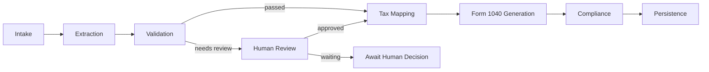

# Documentation

This folder contains the implementation, architecture, deployment, and Foundry
binding documentation for the Agentic Processing Platform.

## Start Here

| Document | Use it for |
| --- | --- |
| [Agent Flow](agent-flow.md) | Understanding the W-2 to draft 1040 orchestration sequence. |
| [Deploy Your Own Environment](deploy-your-own.md) | Setting up Azure and GitHub Actions for your own environment. |
| [GitHub Actions Deployment](github-actions-deployment.md) | CI/CD workflow internals and deployment model. |
| [Architecture](architecture.md) | Logical architecture, security boundaries, and component responsibilities. |
| [Foundry Tool Execution Flow](foundry-tool-execution-flow.md) | How Foundry tool calls reach the Python workers. |
| [Agent-To-Agent vs Supervisor-With-Tools](agent-to-agent-vs-tools.md) | Why the current regulated pipeline uses tools and where A2A fits. |
| [Foundry Registration Automation](foundry-registration-automation.md) | How GitHub Actions creates the Foundry connection and registers the supervisor agent. |

## Implementation Guides

| Document | Description |
| --- | --- |
| [API Documentation](API.md) | API contracts and request/response examples. |
| [Solution Overview](solution-overview.md) | Service pipeline and integration overview. |
| [W-2 Intake Service Design](w2-intake-service-design.md) | Detailed intake service design. |
| [Enterprise Blueprint](enterprise-foundry-tax-ai-blueprint.md) | Broader reference architecture and rationale. |
| [Implementation Phases](implementation-phases.md) | Delivery roadmap and staged build-out. |
| [Getting Started](../GETTING_STARTED.md) | Local setup and validation commands. |
| [Deployment Guide](../DEPLOYMENT_GUIDE.md) | Deployment options and operational notes. |

## Current Capability Map

| Capability | Status | Notes |
| --- | --- | --- |
| W-2 intake | Implemented | Azure Function, Blob Storage, Service Bus eventing, Key Vault settings. |
| Foundry tools host | Implemented | Azure Function exposing HTTP tools for Foundry binding. |
| Agent pipeline | Implemented | Local and deployable supervisor-worker orchestration. |
| W-2 extraction | Implemented | Local deterministic mode and Azure Document Intelligence adapter. |
| Validation | Implemented | Required fields, confidence, format, and amount checks. |
| Human review | Implemented | Local, queue, and manual modes behind configuration. |
| Tax mapping | Implemented | W-2 to 1040-ready payload and planning facts. |
| Form 1040 generation | Implemented | Draft HTML artifact generation with local file or Blob storage. |
| Compliance | Implemented | Governance checks and audit envelope. |
| Tax fact persistence | Implemented | Local JSON and Cosmos DB checkpoint stores. |
| Foundry registration | Implemented | Opt-in GitHub Actions stage creates/updates the OpenAPI project connection and registers the supervisor agent. |

## Agent Sequence



## Key Concepts

- The repository is the solution boundary.
- Azure hosts are deployment boundaries.
- Foundry coordinates the work through tool calls.
- Deterministic Python workers perform regulated tax-processing actions.
- Durable checkpoints allow resume without reprocessing completed stages.
- Generated 1040 artifacts are separate from the 1040-ready data payload.
- PII is masked by default before persistence.

## Validation Commands

```powershell
python -m unittest discover -s tests
python -m compileall src tests
az bicep build --file infrastructure/services/w2-intake/bicep/main.bicep
az bicep build --file infrastructure/services/foundry-tools/bicep/main.bicep
az bicep build --file infrastructure/foundry/bicep/main.bicep
```
