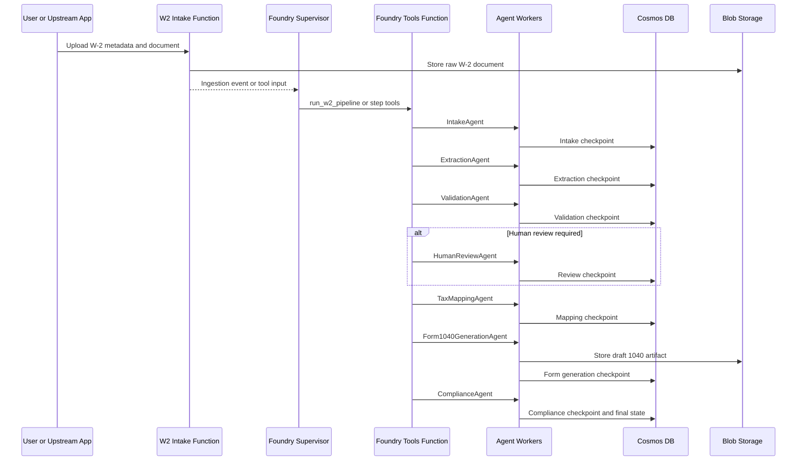
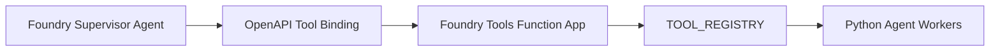

# Agent Flow

This page explains the W-2 to draft Form 1040 orchestration flow for readers
who want to understand the system before deploying it.

## High-Level Sequence



## Stage Responsibilities

| Stage | Responsibility | Durable output |
| --- | --- | --- |
| Intake | Accept an uploaded W-2 reference and initialize pipeline state. | Intake checkpoint |
| Extraction | Convert the W-2 document into normalized W-2 facts. | Masked normalized facts and confidence scores |
| Validation | Apply required-field, format, amount, and confidence checks. | Validation status, issues, warnings |
| Human Review | Route records that need a human decision. | Review packet and decision state |
| Tax Mapping | Map W-2 facts into 1040-ready payloads and planning facts. | `form1040` payload and normalized tax facts |
| Form 1040 Generation | Render a draft 1040 artifact from the mapped payload. | Artifact URI/path, field values, template version |
| Compliance | Verify governance, audit, PII, mapping, and artifact controls. | Compliance checks and audit event |
| Persistence | Upsert the final governed tax fact record. | Complete lifecycle record |

## Data Transition

The platform intentionally separates three different representations:

```text
Raw W-2 document
  -> normalized W-2 facts
  -> 1040-ready payload
  -> draft Form 1040 artifact
```

The extraction agent produces normalized facts. The tax mapping agent converts
those facts into a 1040 payload. The Form 1040 generation agent renders the
payload into a draft artifact. This distinction keeps the system testable and
allows the rendering implementation to evolve from the current HTML draft
renderer to an approved official PDF template adapter later.

## Foundry Tool Pattern

The current implementation uses a supervisor-with-tools pattern:



This is deliberate for regulated processing. LLM reasoning coordinates the
workflow, but deterministic Python workers handle extraction, validation,
mapping, document generation, compliance, and persistence.

The repository also includes `tests/test_agent_to_agent_simulation.py` as a
learning and design test for true agent-to-agent delegation. That pattern may
be useful later for advisory or reasoning-heavy extensions, while the regulated
core pipeline remains tool-backed and auditable.

## Persistence And Recovery

The same governed record is checkpointed as the pipeline advances. If Document
Intelligence succeeds but a later stage fails, the platform can resume from the
persisted normalized facts instead of reprocessing the original document.

Generated 1040 artifacts are also checkpointed. If compliance or final
persistence fails after generation, the artifact metadata remains available for
resume, audit, and cleanup workflows.
