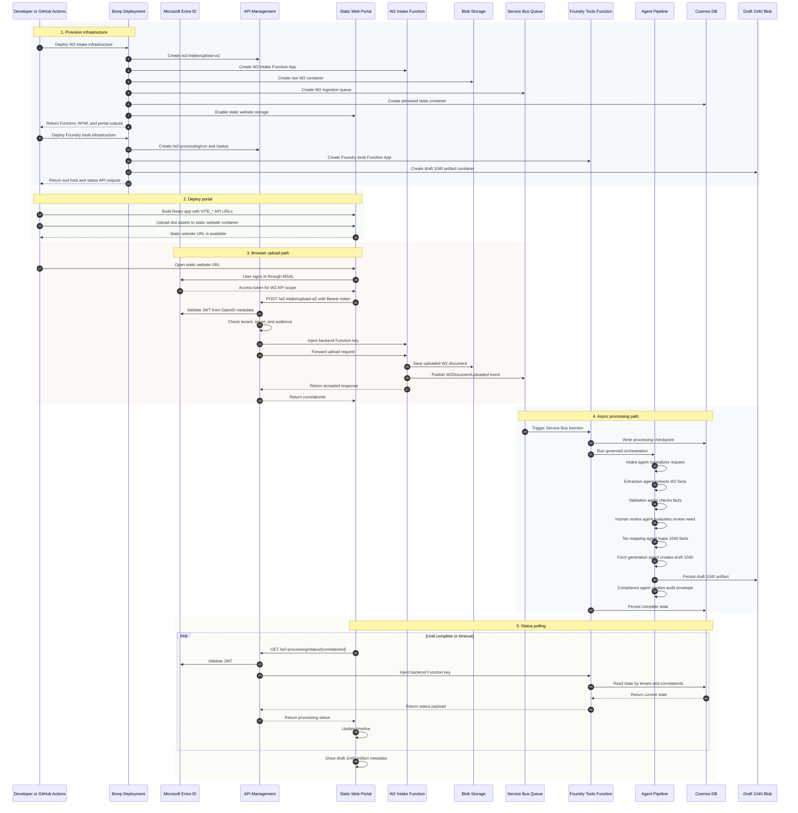
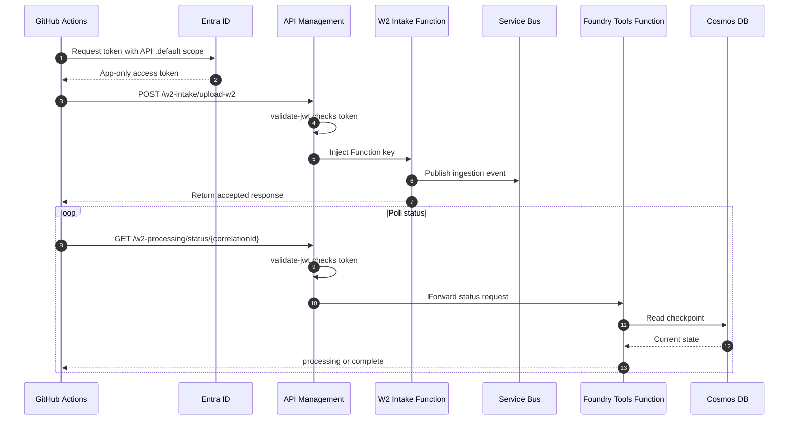

# End-to-End Debugging Flow

This runbook explains how to debug the deployed W-2 to draft 1040 flow from
GitHub Actions through API Management, Azure Functions, Service Bus, Cosmos DB,
and the React upload portal.

## Full Runtime Sequence



## GitHub Actions Smoke Test

The CI smoke test replays the browser flow without a browser.



## Local Direct Smoke Test

When APIM authentication is being debugged separately, the same smoke script can
test the deployed Function Apps directly with Function keys. This validates the
Function packages, Blob write, Service Bus trigger, Cosmos status read, pipeline
execution, and draft 1040 generation.

```powershell
$w2Key = az functionapp keys list `
  --resource-group "<resource-group>" `
  --name "<w2-intake-function-app>" `
  --query functionKeys.default `
  --output tsv

$toolsKey = az functionapp keys list `
  --resource-group "<resource-group>" `
  --name "<foundry-tools-function-app>" `
  --query functionKeys.default `
  --output tsv

.\scripts\azure\Test-W2EndToEndSmoke.ps1 `
  -IntakeApiUrl "https://<w2-intake-function-app>.azurewebsites.net/api/upload-w2" `
  -StatusApiUrl "https://<foundry-tools-function-app>.azurewebsites.net/api/status" `
  -IntakeFunctionKey $w2Key `
  -StatusFunctionKey $toolsKey `
  -TimeoutSeconds 300 `
  -PollIntervalSeconds 5
```

Expected successful output:

```text
Starting W-2 end-to-end smoke test
Intake accepted. Polling pipeline status...
Pipeline status: complete
Smoke test completed successfully.
Form 1040 artifact metadata was returned.
```

## Local APIM Smoke Test

Use this path when validating APIM and Entra end to end.

```powershell
az login --scope "api://<api-client-id>/W2Intake.Upload"

$token = az account get-access-token `
  --scope "api://<api-client-id>/W2Intake.Upload" `
  --query accessToken `
  --output tsv

.\scripts\azure\Test-W2EndToEndSmoke.ps1 `
  -IntakeApiUrl "https://<apim-name>.azure-api.net/w2-intake/upload-w2" `
  -StatusApiUrl "https://<apim-name>.azure-api.net/w2-processing/status" `
  -BearerToken $token `
  -TimeoutSeconds 300 `
  -PollIntervalSeconds 5
```

## Failure Map

| Symptom | Likely boundary | What to check |
| --- | --- | --- |
| Blank portal page | React startup or static asset load | Browser console, Vite build, undefined variables in render path. |
| `app-name should not be empty` | GitHub job output handoff | Avoid masking values that downstream jobs need as outputs. |
| `401 Unauthorized. A valid Entra access token is required.` | APIM JWT validation | Token audience, tenant, app role/scope, `PORTAL_AUTH_AUDIENCE`, APIM policy. |
| `No module named 'azure.storage'` | Function package dependencies | Ensure `.python_packages/lib/site-packages` is included in the deployed zip. |
| Intake accepted, status always 404 | Async/status boundary | Confirm Service Bus trigger is running and status URL shape is correct. |
| Intake accepted, status stays processing | Pipeline runtime | Check Foundry tools Function logs and Cosmos checkpoints. |
| Complete status without artifact | Form generation | Check artifact mode, storage settings, and Form 1040 generation result. |

## Debugging Order

1. Confirm the portal renders with `npm run build`.
2. Confirm Bicep builds for W2 intake and Foundry tools.
3. Confirm Function packages include dependencies.
4. Run direct Function-key smoke test.
5. Run APIM smoke test with Entra token.
6. Run GitHub Actions workflow manually.
7. Use Cosmos checkpoints to identify the last completed pipeline stage.

