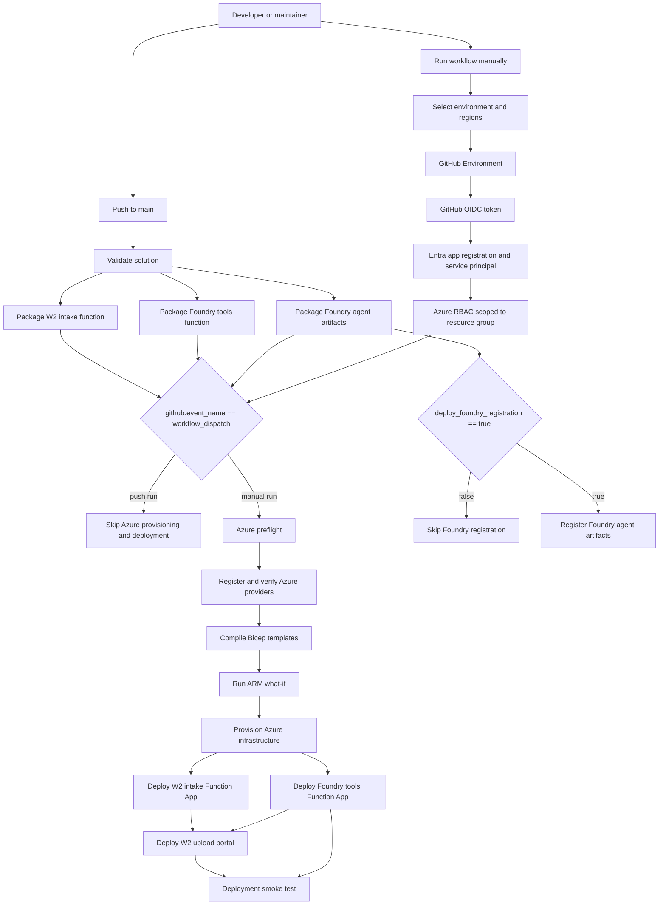

# GitHub Actions Deployment

This repository is a single solution with multiple deployable units. The
workflow in `.github/workflows/deploy-platform.yml` validates the whole solution
on every push. Azure deployment runs only from manual `workflow_dispatch`, so
public repository pushes do not fail when Azure environment secrets are not
configured.

For a step-by-step setup intended for someone deploying their own copy of the
repository, see [Deploy Your Own Environment](deploy-your-own.md).

## Deployment Model

```text
GitHub Actions
|-- validate repo
|-- package W2 intake function
|-- package Foundry agent artifacts
|-- package Foundry tools function
|-- provision Azure infrastructure, manual dispatch only
|-- deploy W2 intake Function App, manual dispatch only
|-- deploy Foundry tools Function App, manual dispatch only
|-- deploy W2 upload portal, manual dispatch only
|-- register Foundry agent, manual dispatch and opt-in only
`-- run smoke tests, manual dispatch only
```

## Deployment Control Flow



The workflow uses `github.event_name` to separate validation from deployment.
Pushes to `main` run validation and packaging. Azure provisioning and Function
App deployment run only when the event is `workflow_dispatch`.

## Bootstrap Script

The bootstrap script can create the Azure resource group and configure
everything GitHub Actions needs:

```powershell
.\scripts\github\bootstrap-github-actions.ps1 `
  -SubscriptionId "<subscription-id>" `
  -TenantId "<tenant-id>" `
  -ResourceGroupName "rg-agentic-tax-dev" `
  -Environment dev `
  -Location eastus `
  -NamePrefix taxai `
  -FoundryProjectEndpoint "https://<foundry-resource>.services.ai.azure.com/api/projects/<project>" `
  -FoundryAccountName "<foundry-account-name>" `
  -FoundryProjectName "<foundry-project-name>" `
  -FoundryModelDeploymentName "<model-deployment-name>" `
  -FoundryOpenApiConnectionName "w2toolsfnkey" `
  -GrantUserAccessAdministrator
```

The script uses Azure CLI and GitHub CLI to:

- register required Azure resource providers in the subscription
- create or reuse the resource group
- create or reuse an Entra app registration
- create or reuse a service principal
- create a GitHub Actions federated credential for the selected GitHub Environment
- assign `Contributor` on the resource group
- assign `Foundry Project Manager` on the Foundry project when
  `FoundryAccountName` and `FoundryProjectName` are provided
- create the GitHub Environment
- set GitHub environment secrets
- set GitHub environment variables
- optionally set Foundry registration variables for that environment

Use `-GrantUserAccessAdministrator` only when the workflow must create Azure RBAC
role assignments. Keep that permission scoped to the resource group.

Foundry agent registration uses the Foundry data plane, not only Azure ARM.
The GitHub Actions service principal therefore needs a Foundry project-scoped
role with `Microsoft.CognitiveServices/accounts/AIServices/agents/write`. The
bootstrap script grants `Foundry Project Manager` at:

```text
/subscriptions/<subscription-id>/resourceGroups/<resource-group>/providers/Microsoft.CognitiveServices/accounts/<foundry-account>/projects/<foundry-project>
```

If you see `PermissionDenied` for `AIServices/agents/write`, rerun bootstrap
with `-FoundryAccountName` and `-FoundryProjectName`, wait a few minutes for
RBAC propagation, and rerun the workflow.

## Required Local Tools

The bootstrap script requires:

- Azure CLI, authenticated with `az login`
- GitHub CLI, authenticated with `gh auth login`

## GitHub Secrets

The bootstrap script configures these environment secrets:

- `AZURE_CLIENT_ID`
- `AZURE_TENANT_ID`
- `AZURE_SUBSCRIPTION_ID`

## GitHub Variables

The bootstrap script configures these environment variables:

- `AZURE_RESOURCE_GROUP`
- `AZURE_LOCATION`
- `NAME_PREFIX`
- `FOUNDRY_PROJECT_ENDPOINT`, when supplied to bootstrap
- `FOUNDRY_ACCOUNT_NAME`, when supplied to bootstrap
- `FOUNDRY_PROJECT_NAME`, when supplied to bootstrap
- `FOUNDRY_MODEL_DEPLOYMENT_NAME`, when supplied to bootstrap
- `FOUNDRY_OPENAPI_CONNECTION_NAME`, when supplied to bootstrap

The workflow also creates or reuses the configured resource group before
deploying Bicep.

## Azure Preflight

Before creating or updating resources, the workflow runs the same preflight you
can run locally:

```powershell
.\scripts\azure\Test-AzureDeploymentPreflight.ps1 `
  -ResourceGroupName "rg-agentic-tax-dev" `
  -Environment dev `
  -Location eastus `
  -CosmosLocation eastus2 `
  -NamePrefix taxai
```

The preflight compiles the deployable Bicep templates and runs ARM `what-if` for
the W2 intake host and Foundry tools host. This catches unsupported API versions,
provider registration issues, resource name/location conflicts, and subscription
quota problems before the workflow starts provisioning.

Provider registration is subscription-scoped. The bootstrap and preflight scripts
register/check the providers used by this solution, including `Microsoft.Web`,
`Microsoft.ServiceBus`, `Microsoft.DocumentDB`, `Microsoft.Storage`,
`Microsoft.KeyVault`, `Microsoft.ApiManagement`, `Microsoft.Insights`,
`Microsoft.OperationalInsights`, and `Microsoft.Authorization`.

Cosmos DB has its own location parameter because Cosmos capacity can differ from
the rest of the Azure platform capacity. For dev, the workflow defaults the
platform region to `eastus` and Cosmos DB to `eastus2`.

If preflight reports `SubscriptionIsOverQuotaForSku` for
`Microsoft.Web/serverFarms`, the Bicep is valid but the subscription does not
currently have enough App Service/Functions quota in that region. Resolve that
by requesting quota for the selected region or dispatching the workflow with a
region where the subscription has available quota.

## Secret Management

The W2 intake Bicep creates Azure Key Vault and stores connection-string secrets
there instead of placing secret values directly in Function App settings.

Current scripted secret flow:

```text
Storage connection string
  -> Key Vault secret: w2-storage-connection-string
  -> Function App setting: W2_STORAGE_CONNECTION_STRING

Service Bus connection string
  -> Key Vault secret: w2-servicebus-connection-string
  -> Function App setting: W2_SERVICEBUS_CONNECTION_STRING
```

The Function App uses a system-assigned managed identity. Bicep grants that
identity Key Vault `get` and `list` permissions for secrets, and the app settings
use Key Vault references:

```text
@Microsoft.KeyVault(SecretUri=<secret-uri>)
```

Cosmos DB access uses managed identity and Cosmos DB SQL RBAC, so no Cosmos key
is required for production runtime.

`AzureWebJobsStorage` is intentionally set to the concrete Function storage
connection string. The Azure Functions deployment action uses this setting to
upload `WEBSITE_RUN_FROM_PACKAGE` content for Linux Consumption apps and cannot
publish when the value is a Key Vault reference. Business/runtime data settings
continue to use Key Vault references or managed identity where supported.

API Management stores backend Function keys as secret named values and injects
them server-side for upload and processing operations. The React portal is
configured only with APIM URLs, not Function App URLs or keys.

When upload portal authentication is enabled during bootstrap, the workflow also
configures APIM `validate-jwt` with the portal API app audience and builds the
React app with MSAL settings from GitHub Environment variables.

Python Function Apps use the v2 programming model with worker indexing enabled.
The workflow requests Oryx remote build during Function deployment so Azure
installs Python dependencies from `requirements.txt` before trigger sync.

## Environments

The workflow supports `dev`, `test`, `uat`, and `prod` through manual
`workflow_dispatch` inputs. Pushes to `main` run validation and packaging only.
The manual dispatch inputs include a platform `location` and a separate
`cosmos_location` for the Cosmos DB account.

Foundry registration is also manual and opt-in. Select
`deploy_foundry_registration` only after the Foundry project and model deployment
exist. The registration step requires:

- `foundry_project_endpoint`: the Foundry project endpoint, for example
  `https://<resource>.services.ai.azure.com/api/projects/<project>`.
- `foundry_account_name`: the Azure AI Foundry account resource name.
- `foundry_project_name`: the Azure AI Foundry project resource name.
- `foundry_model_deployment_name`: the deployed model name that backs the
  supervisor agent.
- `foundry_openapi_connection_name`: the Foundry project connection name to
  create or update. The default is `w2toolsfnkey`.

The workflow creates or updates the Foundry project connection automatically
unless `foundry_openapi_connection_id` is supplied. The scripted connection flow:

```text
Deployed Foundry tools Function App
  -> read default Function host key using GitHub OIDC identity
  -> create/update Foundry project connection
  -> store custom key named x-functions-key
  -> pass connection resource ID to agent registration
```

The workflow then resolves `src/services/foundry-tools/openapi.json` to the
deployed `/api` endpoint, adds the matching OpenAPI security scheme, and
registers the supervisor agent with an OpenAPI tool definition. The Function key
is not stored in GitHub secrets, workflow inputs, or source control.

If you already manage the connection outside this workflow, pass
`foundry_openapi_connection_id` and the create/update step is skipped.

Use `prepare_foundry_registration_only` to generate the resolved OpenAPI spec
and registration payload as workflow artifacts without calling the Foundry
registration API. This is useful for review, troubleshooting, and validating the
exact payload that will be sent to Foundry.

Use GitHub Environments for approval gates and environment-specific secrets or
variables. A common setup is:

```text
dev   - no approval
test  - optional approval
uat   - business approval
prod  - required approval
```

## Current Hosts

The workflow fully supports:

- `src/services/w2-intake` deployed to the Function App created by
  `infrastructure/services/w2-intake/bicep/main.bicep`.
- `src/apps/w2-upload-portal` built as a React static application and deployed
  to the static website storage account created by the W2 intake infrastructure.
- `src/services/foundry-tools` deployed to the Function App created by
  `infrastructure/services/foundry-tools/bicep/main.bicep`.

The W2 intake infrastructure configures:

- API Management Consumption SKU.
- `POST /w2-intake/upload-w2` APIM operation.
- APIM CORS policy for the deployed portal origin and local development.
- APIM secret named value containing the backend Function key.
- Optional APIM JWT validation for the Entra-protected upload portal.
- APIM gateway-level rate limiting is intentionally not enabled on the
  Consumption SKU because `rate-limit-by-key` is not supported there. Use a
  higher APIM SKU before enabling those policies.

The Foundry tools infrastructure also provisions the Blob container used for
draft Form 1040 artifacts, configures the tools Function App for Blob-backed
artifact storage, adds the Service Bus-triggered async processor, and exposes
APIM processing endpoints:

- `POST /w2-processing/run` for direct diagnostics and Foundry-style tool execution.
- `GET /w2-processing/status/{correlationId}` for portal polling and smoke tests.

Both Function Apps use the shared environment-level Log Analytics workspace and
Application Insights component created by the W2 intake infrastructure. Separate
observability resources should be introduced only for distinct ownership,
retention, compliance, or scale boundaries.

The workflow can register:

- The Foundry supervisor agent from `src/foundry_agents/agent.yaml`
- The supervisor prompt from `src/foundry_agents/prompts/supervisor.md`
- The deployed Foundry tools Function App as an OpenAPI tool

The registration job stays inactive unless `deploy_foundry_registration` is
selected during manual workflow dispatch.

The Foundry connection automation is implemented in:

```text
scripts/foundry/Ensure-FoundryOpenApiConnection.ps1
scripts/foundry/Register-FoundryAgent.ps1
```

## Deployed Azure Hosts

```text
W2 intake Function App
  Receives document-upload requests and publishes ingestion events.

W2 upload portal
  Browser-based synthetic W-2 upload experience that calls API Management for
  intake upload and polls API Management for async pipeline status.

API Management
  Fronts the W2 intake and W2 processing APIs and injects backend Function
  authentication server-side.

Foundry tools Function App
  Exposes HTTP endpoints for the Foundry supervisor agent tools, processes
  Service Bus W-2 ingestion events asynchronously, and stores generated draft
  1040 artifacts.

Azure AI Foundry supervisor agent
  Registered from agent.yaml, prompts, tool schemas, and eval configuration.
```

The Foundry tools host packages `src/services/foundry-tools` together with the
shared `src/foundry_agents` package, so every HTTP endpoint can call
`TOOL_REGISTRY` and the governed Python agent workers.

Important tool endpoints include:

```text
POST /api/run-w2-pipeline
GET /api/status/{correlationId}
POST /api/extract-w2-document
POST /api/map-w2-tax-facts
POST /api/generate-form-1040-document
POST /api/evaluate-w2-compliance
```

`src/services/foundry-tools/openapi.json` documents the HTTP endpoint binding.
Its `operationId` values use Foundry-compatible names with letters and
underscores only. The HTTP routes still map to the governed Python tool registry
in `src/foundry_agents/tools/w2_pipeline_tools.json`.

## Why This Is One Solution And Multiple Hosts

The repo is the system boundary. Each Azure host is a deployment boundary.

```text
One repo commit
|-- validates the solution on push
|-- can deploy W2 intake host by manual dispatch
|-- can deploy tool host by manual dispatch
|-- can register Foundry agent when registration is enabled
`-- keeps all versions traceable together
```

This keeps the business capability layer and Foundry layer together in source
control while still allowing each runtime to scale, secure, and deploy
independently.

## Deployment Smoke Test

The `smoke-test` job is a real end-to-end test. It submits a synthetic W-2
through APIM, verifies the intake response, then polls the APIM status endpoint
until the governed pipeline reaches `complete` and returns Form 1040 artifact
metadata.

The smoke test script is:

```text
scripts/azure/Test-W2EndToEndSmoke.ps1
```

When portal/APIM authentication is enabled, rerun bootstrap with
`-EnableUploadPortalAuthentication`. The bootstrap grants the GitHub Actions
OIDC service principal a smoke-test application role on the portal API app
registration. During the workflow, GitHub Actions mints a short-lived access
token for the APIM audience and uses that token for the smoke test. No reusable
bearer token is stored in GitHub.
