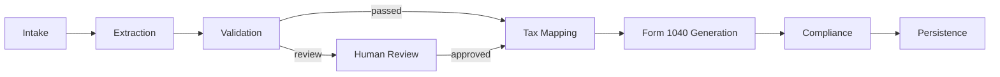
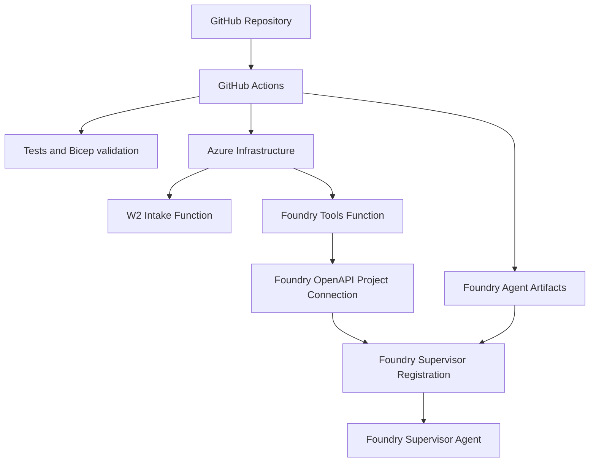

# Microsoft Foundry Tax Intelligence Platform

Enterprise reference implementation for governed W-2 processing, Microsoft
Foundry orchestration, draft Form 1040 generation, compliance, and durable tax
fact persistence.

## Read First

1. [Agent Flow](agent-flow.md)
2. [Deploy Your Own Environment](deploy-your-own.md)
3. [GitHub Actions Deployment](github-actions-deployment.md)
4. [Architecture](architecture.md)
5. [Foundry Tool Execution Flow](foundry-tool-execution-flow.md)

## Agent Flow

## Deployment Flow

## Key Outcomes

- Upload and process W-2 documents.
- Extract normalized W-2 facts locally or with Azure AI Document Intelligence.
- Validate required fields and confidence.
- Route low-confidence or invalid records to human review.
- Map W-2 facts into 1040-ready payloads.
- Generate draft Form 1040 artifacts.
- Persist governed checkpoints in Cosmos DB.
- Deploy Azure hosts through GitHub Actions.
- Register the Foundry supervisor agent with the deployed OpenAPI tool host.

## Documentation

See the [Documentation Index](README.md) for the full guide list.
